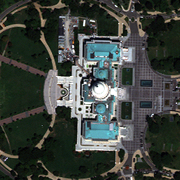
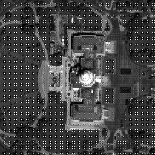
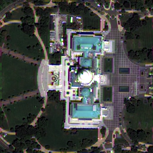
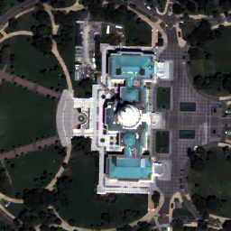

# JoDeFu

Implementation in MATLAB of the *multiresolution compressed acquisition* (MRCA) image formation and *joint demosaicing and fusion* (JoDeFu) image reconstruction method.

## Description

The code is able to:
- model an optical acquisition of the MRCA, a device based on color filter arrays (CFAs) and/or multiresolution sensors;
- reconstruct an image datacube from their acquisition with the JoDeFu, a Bayesian inversion algorithm;
- compare the results of the estimated products with respect to classical demosaicing and sharpening algorithms.

An example of the expected results is given by the images below:


|          |          |     
|:----------------------------------------------------------------------------------------------------------------------------------------------------------:|:-------------------------------------------------------------------------------------------------------------------------------------------------------------------:|
|                                                                         Reference                                                                          |                                                                          MRCA acquisition                                                                           |
|  |  |
|                                                                 Classic v2 reconstruction                                                                  |                                                                      JoDeFu v1 reconstruction                                                                       |

## Getting started

### Dependencies

The script requires the following MATLAB toolboxes:
- Signal Processing Toolbox
- Image Processing Toolbox
- Wavelet Toolbox

The provided scripts were tested on a licensed *MATLAB 2018b* version on a machine running *Window 10*.

### Demo scripts

The repository contains demo scripts for the experiments provided in the associated article, which, for the user convenience, are all located in the `src\main` folder and the results are saved in the `data\output` folder. 
The results obtained running these algorithms fully match the ones given in the associated article.
Specifically, the following tests are available:
- **Image formation**: Scripts which test the quality of image reconstructed starting from acquisitions modeled through a variety of image formation methods:
  - `demo_formation_mrca.m`:  reconstructed through the JoDeFu v1 algorithm;
  - `demo_formation_classic.m`:  reconstructed with classic noniterative algorithms;
  - `demo_formation_cassi.m`: reconstructed from CASSI acquisitions both with the CASSI decoder and JoDeFu v1;
  - `demo_formation_software.m`: obtained with software compression encoders/decoders.
- **Image reconstruction**: Scripts testing various reconstruction algorithm processing an MRCA acquisition:
  - `demo_reconstruction_jodefu.m`: reconstructed through JoDeFu v1 and v2.
  - `demo_reconstruction_classic.m`: reconstructed through cascaded classic demosaicing and sharpening algorithms;
- **Setting of parameters**: Scripts testing the settings of the JoDeFu algorithm:
  - `demo_parameters.m`: by varying the regularization parameter, the metric function norm, the total variation linear operator and the blurring diameter.

### How to use

The MRCA model simulated acquisition and JoDeFu algorithm with validation can be run through `src/jodefu/wrapper_compressed_acquisition.m` with the following code snippet:
```
[I_out, I_acq, mask_out, MR] = wrapper_compressed_acquisition('im', im,...
    'ratio', ratio, 'mask', mask, 'test', test, 'inv', inv, 'radius', d_b,...
    'lambda', lambda, 'iter', iter, 'preproc', preproc, 'output', output);
```
where:
- `im`: is an image tag string, in the format `'place_cutM_N'` (e.g. `'Washington_cut256_4'`):
  - `place`: is the location label (`Washington`, `Janeiro`, `Beijing`, `Hobart`, `SanFrancisco`, `Stockholm`);
  - `M`: is the image side size (`256` or `512`);
  - `N`: is the number of channels (`3`, `4`, or `8` if available);
- `ratio` is the integer scale ratio between the PAN and MS (e.g., `2` or `4`)
- `mask` is a string label for the mask used by the MRCA framework:
  - `'Bayer'`: for a Bayer mask;
  - `'BinaryTreeU'`: for an uniform binary tree mask;
  - `'CASSI'`: for a CASSI encoder;
- `test` is a label string to describe the MRCA framework:
  - `'default'`: for the full MRCA;
  - `'nomask'`: for the multiresolution sensing;
  - `'msonly'`: for the mosaicing;
- `inv` is a struct with information about the image formation:
  - `{'TV_c', 'norm_l221','none'}` for the JoDeFu v1;
  - `{'TV_u', 'norm_S1l1','none'}` for the JoDeFu v2 with upwind total variation (UTV);
  - `{'TV_s2', 'norm_S1l1','none'}` for the JoDeFu v2 with Shannon total variation (STV) with magnification factor 2;
  - `{'none', 'norm_l111','CAS_sym8'}` for the CASSI LASSO decoder;
- `d_b` is a float above 1, representing the blurring diameter (e.g. `1` or `1.4`);
- `lambda` is the normalized regularization parameter (e.g. `0.001`);
- `iter` is the number of iterations of the JoDeFu algorithm (e.g. `250`);
- `preproc` is a string that describes the method to evaluate the coefficients for the spatial degradation:
  - `'regravg'`: all coefficients are identical (after the MS is histogram matched to the PAN);
  - `'hism'`: the coefficients are evaluated with linear regression;
- `output`: is a string describing the subfolder to save results under `data\output` (e.g. `'results_test'`)

The script returns:
- `I_out`: The reconstructed estimated product;
- `I_acq`: The simulated acquisition;
- `mask_out`: The mask generated for image formation;
- `MR`: A struct containing the verification results.

## License

This project is licensed under the [MIT](LICENSE.md) License - see the LICENSE.md file for details.

## Acknowledgments

Some included code snippets are inspired or modified from:
* [Laurent Condat's convex optimization toolbox](https://lcondat.github.io/software.html)
* [Gemine Vivone's open remote sensing pansharpening toolbox](https://openremotesensing.net/knowledgebase/a-critical-comparison-among-pansharpening-algorithms/)
* [BlindFuse](https://github.com/qw245/BlindFuse)
* [Residual interpolation](http://www.ok.sc.e.titech.ac.jp/res/DM/RI.html)
* [Alternating projections](http://www.ece.lsu.edu/ipl/Software.html)
* [Multiscale gradients-based color filter array interpolation](https://sites.google.com/site/ibrahimepekkucuksen/publications)
* [Shannon total variation](https://helios2.mi.parisdescartes.fr/~rabergel/)
* [Scott Sarra's radial basis function toolbox](https://openresearchsoftware.metajnl.com/articles/10.5334/jors.131/)

The provided sample datasets are courtesy of Maxar:
* [Maxar sample products](https://resources.maxar.com/product-samples)

## Citation
If you use this code, please cite:

```
@article{picone2022jodefu,
author = {Picone, Daniele and Condat, Laurent and Dalla Mura, Mauro},
title = {Joint demosaicing and fusion of multiresolution compressed acquisitions: {Image} formation and reconstruction methods},
booktitle = {IEEE Transactions on Computational Imaging},
note = {Under review.}
month = {#aug#},
year = {2022}
}
```